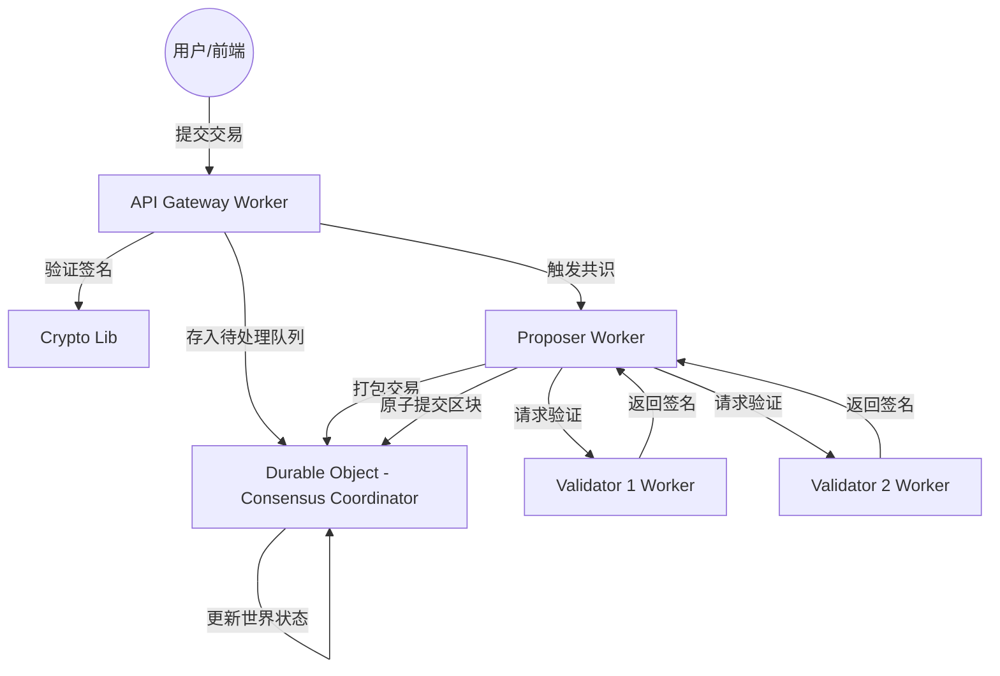

# Serverless Blockchain Network

本项目是一个基于 Cloudflare 边缘计算平台（Workers & Durable Objects）构建的去中心化区块链原型（MVP）。它利用了 Cloudflare 的全球网络来实现高性能、零燃料费（Zero-Gas）以及强一致性的分布式账本。

## 核心特性

- **边缘共识**: 利用 Cloudflare Durable Objects 实现基于 BFT（拜占庭容错）逻辑的强一致性协调。
- **高性能**: 交易在边缘节点直接处理，显著降低延迟。
- **安全性**: 采用 Ed25519 签名算法（基于 `@noble/ed25519` v3.0.0）进行身份验证和数据完整性校验。
- **开发者友好**: 提供完整的 Web 前端集成示例，支持多种语言和暗黑模式。

## 系统架构



### 关键组件

1.  **API Gateway (`src/workers/api.ts`)**: 系统入口，负责交易接收、身份验证、状态查询及 Faucet（水龙头）功能。
2.  **Consensus Coordinator (`src/durable-objects/consensus.ts`)**: 核心状态机，维护账户余额、Nonce、区块历史以及交易队列。
3.  **Proposer (`src/workers/proposer.ts`)**: 区块提议者，负责从队列中提取交易，收集节点验证，并完成区块提交。
4.  **Validator (`src/workers/validator.ts`)**: 独立验证节点，对 Proposer 提议的区块进行合法性校验并加盖数字签名。

## 快速开始

### 1. 前提条件

- [Node.js](https://nodejs.org/) v20+
- [Cloudflare 账户](https://dash.cloudflare.com/) 且拥有 Workers 控制权限
- 安装 Wrangler CLI: `npm install -g wrangler`

### 2. 后端部署 (Workers)

进入 `blockchain-mvp` 目录：

```bash
cd blockchain-mvp
npm install
# 部署 API Gateway 及 Durable Objects
npx wrangler deploy
# 部署 Proposer
npx wrangler deploy --env proposer
# 部署验证者
npx wrangler deploy --env validator1
npx wrangler deploy --env validator2
```

### 3. 前端部署 (Pages)

进入 `app` 目录：

```bash
cd app
npm install
# 构建
npm run build
# 部署到 Cloudflare Pages
npx wrangler pages deploy dist --project-name serverless-blockchain-frontend
```

## 🛡️ 备份与灾难恢复 (Backup & Disaster Recovery)

本系统内置了基于 IPFS (Pinata) 的加密备份机制。

### 配置
必须在 Cloudflare Workers 中配置以下 Secrets：
- `PINATA_JWT`: Pinata API 的 JWT 令牌。
- `BACKUP_ENCRYPTION_KEY`: 64位十六进制 AES-256-GCM 密钥。

### 自动备份
- 系统每 10 个区块或每 90 分钟自动执行一次备份。
- 备份采用 **TTL=10** 轮转策略，自动清理旧数据。

### 灾难恢复 (Disaster Recovery)
当数据完全丢失时，使用恢复脚本重置链状态：

```bash
# 语法
node scripts/restore.js <CID> <ENCRYPTION_KEY>

# 示例
node scripts/restore.js QmHash... af17...26
```

> **注意**: 恢复操作会强制覆盖当前链的所有状态，且仅允许恢复 `backup_index` 中记录的最新的 CID。

### 4. 初始化与管理 (Genesis Management)

区块链在部署后需要进行创世初始化。为了确保账本安全，项目实现了**不可篡改创世 (Immutable Genesis)** 逻辑：

- **普通初始化**: 首次部署后，通过 Admin 面板或 API 触发。创世块将自动记录当前服务器时间作为 `genesisTime`。
- **安全锁定**: 一旦区块高度 > 0，系统将自动锁定初始化接口，禁止任何重置操作。
- **强制重置 (Force Reset)**: 在极端维护情况下，Admin 可以通过管理面板勾选 "Force Reset" 选项来绕过锁定并重新初始化链（将清除所有数据）。

可以通过管理面板执行操作：
`https://your-frontend-url.pages.dev/admin` (默认密码: `admin123`)

或使用 curl (需带 force 标志)：
```bash
# 首次初始化
curl -X POST https://your-worker-url.workers.dev/admin/init-genesis -H "Content-Type: application/json" -d '{"force": false}'
```

## 开发与调试

- **本地测试**: 使用 `npm run dev` 启动前端。
- **加密校验**: 项目统一采用统一的 Noble Ed25519 库，确保前后端计算逻辑 100% 对齐。
- **状态追踪**: 前端集成 `TransactionTracker` 组件，可实时监控交易从“提交”到“共识”再到“上链”的全过程。

## 开源协议

本项目基于 MIT 协议开源。
